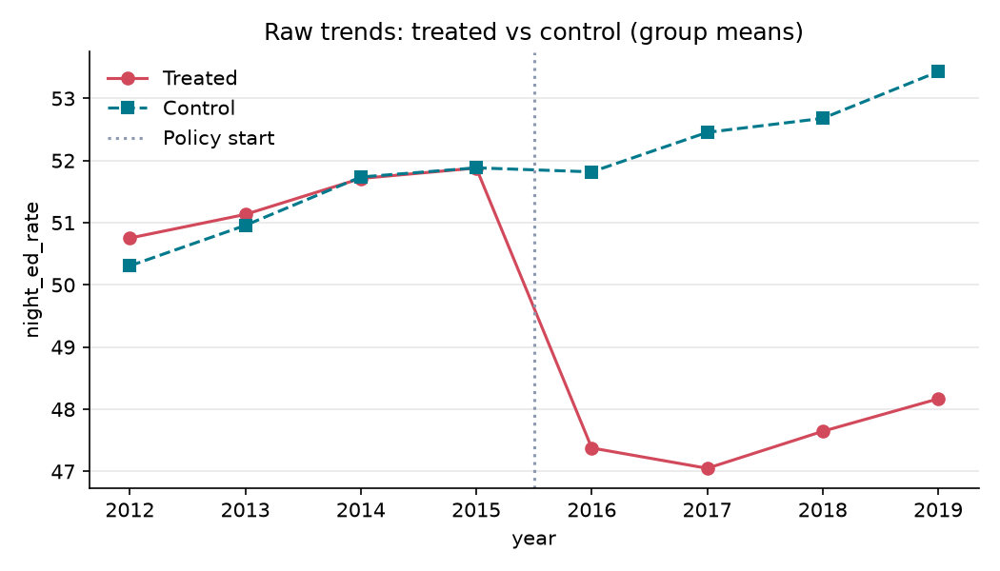
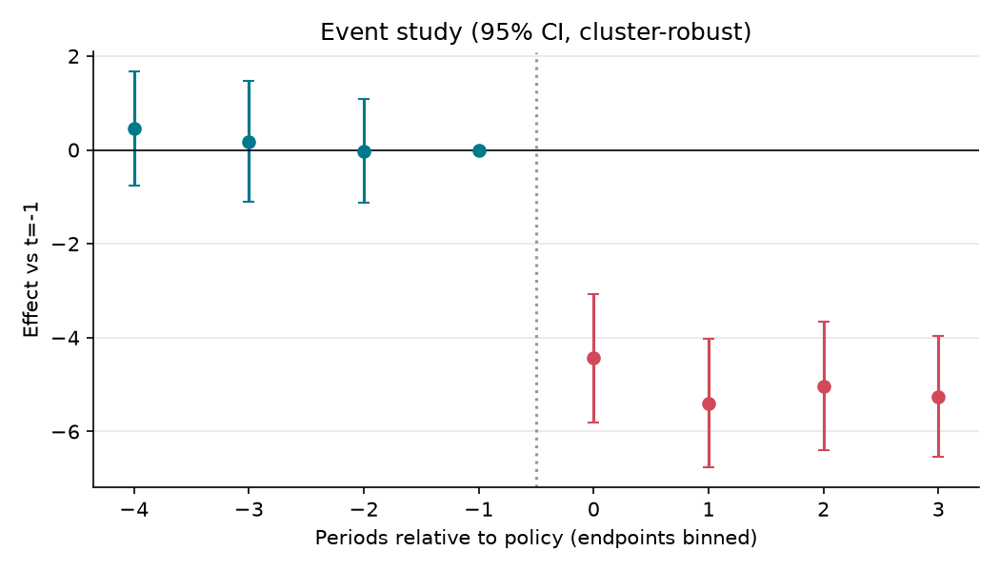

# [예제·합성데이터] 달빛어린이병원 지정이 소아 야간 경증 응급실 방문에 미친 효과

> **⚠️ 합성(synthetic) 데이터입니다. 아래 수치는 실제 정책 효과가 아니며, 파이프라인 시연용입니다.**

**분석 질문**: 달빛어린이병원(야간·휴일 소아 경증 진료기관)이 지정된 시군구에서, 지정되지 않은 시군구 대비 소아 야간 경증 응급실 방문율이 감소했는가?

**종합 판정**: ✅ 식별됨 (가정 하에서)

**요약**: 정책 도입 후 처치집단의 소아 야간 경증 응급실 방문율은(는) 통제집단 대비 평균 -5.03 건/천명 변화한 것으로 추정됩니다 (95% CI -6.11 ~ -3.96). 이 해석은 plan.yaml 의 식별 가정이 성립할 때에만 유효하며, 자동 점검에서 가정이 반박되지 않았다는 뜻이지 검증되었다는 뜻은 아닙니다.

## 1. 설계

- 분석 단위: 시군구 (`region_id`), 기간 2012–2019 (year)
- 처치: 2016년에 달빛어린이병원이 1곳 이상 지정된 시군구 (예제 단순화: 동시 도입)
- 통제: 2019년까지 지정 이력이 없는 시군구 — 처치 지역과 도입 전 방문율 추세가 평행하다고 가정 (event study 사전계수로 점검)
- 주 결과변수: 소아 야간 경증 응급실 방문율 — 0~14세 인구 1,000명당 18시~익일 09시 KTAS 4~5등급 응급실 방문 건수 (연간)
- 추정 방법: `event_study` (cluster: `region_id`)

## 2. 결과

| 방법 | 결과변수 | 추정치 | 95% CI | p | N | 클러스터 | 판정 |
|---|---|---:|---|---:|---:|---:|---|
| event_study | night_ed_rate | -5.033 | [-6.105, -3.960] | <0.001 | 640 | 80 | ✅ 식별됨 (가정 하에서) |

## 3. 가정 점검 및 반박 검정

| 가정 | 점검 방법 | 결과 |
|---|---|---|
| 평행추세 | pretrend_test | 사전계수 결합 Wald p=0.891 → 통과 |
| 도입시점 외생성 | placebo_time | 가짜 도입(2014) 추정 -0.325, p=0.525 → 통과 |
| 파급효과 없음(SUTVA) | manual | 수동 검토 필요 |

## 4. 경고 및 보류 조건

- (자동 경고 없음 — 그래도 가정은 검증된 것이 아니라 '반박되지 않은' 것입니다)

## 5. 데이터 출처

| 이름 | 제공 | 라이선스 | URL |
|---|---|---|---|
| 합성 시군구 패널 (simulate_panel, seed=42, 참효과 -5.0) | core.adapters.synthetic | synthetic | - |
