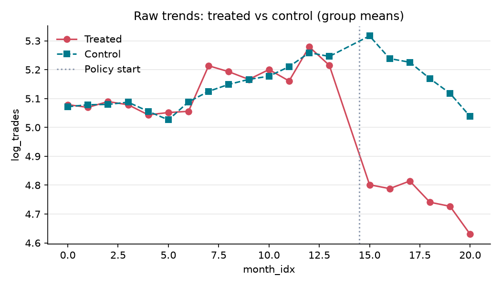
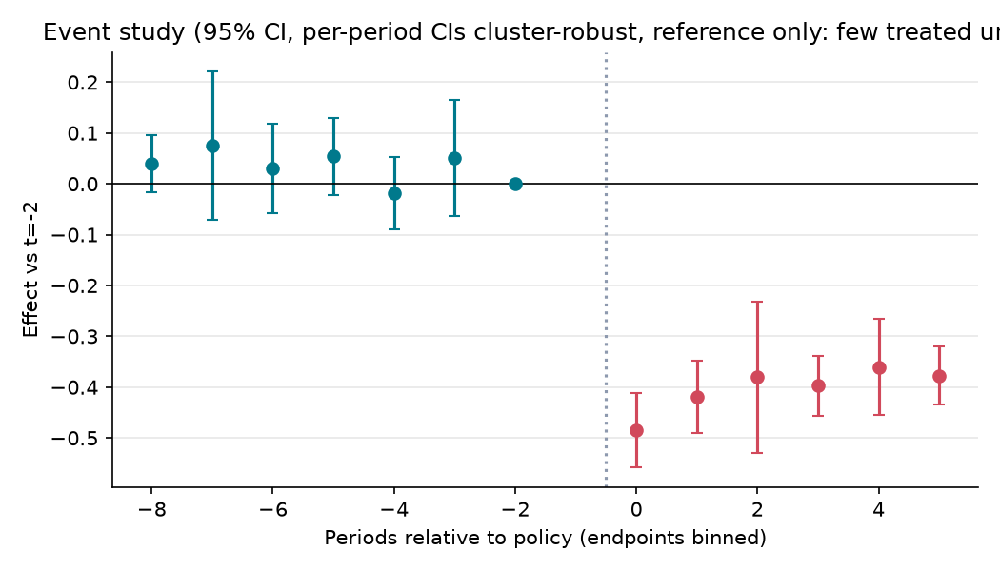

# 토지거래허가구역 확대 지정(2025.3.24)이 강남·서초·송파·용산 아파트 거래에 미친 효과

> **⚠️ 합성(synthetic) 데이터입니다. 아래 수치는 실제 정책 효과가 아니며, 파이프라인 시연용입니다.**

**분석 질문**: 2025년 3월 24일 강남·서초·송파·용산구 전체 아파트를 토지거래허가구역으로 지정한 뒤, 서울의 나머지 21개 자치구와 비교해 이 4개 구의 아파트 매매 거래건수와 ㎡당 가격이 달라졌는가?

**종합 판정**: ⚠️ 조건부

**요약**: 정책 도입 후 처치집단의 아파트 매매 거래건수(로그)은(는) 통제집단 대비 평균 -0.40 log 건 변화한 것으로 추정됩니다 (95% CI -0.49 ~ -0.32). 이 해석은 plan.yaml 의 식별 가정이 성립할 때에만 유효하며, 자동 점검에서 가정이 반박되지 않았다는 뜻이지 검증되었다는 뜻은 아닙니다.

## 1. 설계

- 분석 단위: 자치구 (`gu_code`), 기간 0–20 (month)
- 처치: 2025.3.24 토지거래허가구역 전역 지정 자치구(서초·강남·송파·용산). 첫 처치 월 = 2025-04 (month_idx 15)
- 통제: 서울 나머지 21개 자치구 (2025.9까지 미지정) — 같은 금리·대출 규제·서울 전체 수요 충격을 받으므로 지정이 없었을 때의 추세를 대리한다. 2025.10.20부터 서울 전역이 지정(10·15 대책)되어 그 이후는 대조군이 사라지므로 분석 기간에서 뺀다.

- 주 결과변수: 아파트 매매 거래건수(로그) — log(1 + 자치구·계약월별 아파트 매매 건수), 해제 거래 제외
- 추정 방법: `event_study` (cluster: `gu_code`)

## 2. 결과

| 방법 | 결과변수 | 추정치 | 95% CI | p | N | 클러스터 | 판정 |
|---|---|---:|---|---:|---:|---:|---|
| event_study | log_trades | -0.403 | [-0.494, -0.323] | 0.001 | 500 | 25 | ✅ 식별됨 (가정 하에서) |
| event_study | log_price_m2 | 0.014 | [-0.004, 0.031] | 0.121 | 500 | 25 | ⚠️ 조건부 |

## 3. 가정 점검 및 반박 검정

| 가정 | 점검 방법 | 결과 |
|---|---|---|
| 평행추세 | pretrend_test | randomization inference (사전 계수 제곱합) p=0.483 → 통과 |
| 선반영 없음 | placebo_time | 가짜 도입(12) 추정 -0.012, p=0.719 → 통과 |
| 파급효과 없음(SUTVA) | manual | 수동 검토 필요 |

## 4. 경고 및 보류 조건

- 신뢰구간이 0을 포함합니다. '효과 없음'이 아니라 '효과 크기를 판별할 수 없음'으로 해석하세요.
- 처치 단위가 4개뿐이라 군집-강건 표준오차를 믿을 수 없습니다. 무작위화 추론(처치 단위를 무작위로 바꿔 반복)으로 p값과 신뢰구간을 계산했습니다.

## 5. 데이터 출처

| 이름 | 제공 | 라이선스 | URL |
|---|---|---|---|
| 시뮬레이션 자치구×월 패널 (fetch.py, seed=7) — 실데이터 아님 | core.adapters.synthetic | synthetic | - |
| 국토교통부_아파트 매매 실거래가 상세 자료 | 국토교통부 (공공데이터포털 15126468) | KOGL-1 | https://www.data.go.kr/data/15126468/openapi.do |
